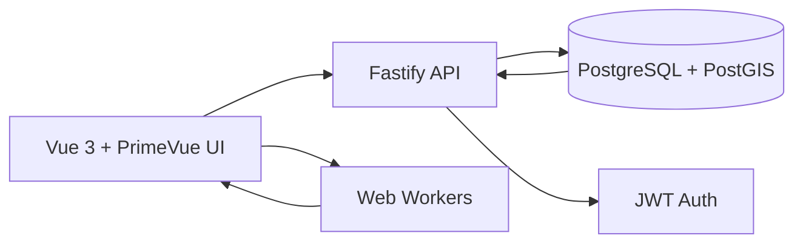

# EGOGeo Frontend

<p>
	
	
	
	
</p>

> High-volume geospatial visualization and polygon workflows for customer assignment.

## Full Stack Snapshot



## Color Direction

| Role | Color |
| --- | --- |
| Brand dark | `#0F172A` |
| Surface muted | `#334155` |
| Primary accent | `#EA580C` |
| Secondary accent | `#F59E0B` |
| Success | `#059669` |

## Strategy Used for 18k Points

The current architecture is optimized across frontend, backend, and database to keep the UI responsive while rendering and classifying many points in real time.

1. Viewport-first fetching.
Only points inside the current map bounds are requested. This reduces payload size and avoids rendering irrelevant data.

2. Worker-based marker transformation.
Point processing is moved to `clientes-markers.worker.ts`, preventing main-thread blocking during marker creation.

3. Marker clustering.
`@googlemaps/markerclusterer` groups nearby markers and renders aggregate icons, dramatically reducing DOM/overlay pressure.

4. Worker-based polygon coloring.
Point-in-polygon classification runs in `polygon-coloring.worker.ts`, so map interactions stay fluid while colors update.

5. Controlled redraw lifecycle.
Debounced viewport updates, stale-response versioning, and explicit marker/cluster cleanup prevent duplicate work and race conditions.

6. Spatial queries at DB layer.
Polygon and point relations are resolved with PostGIS functions (for example `ST_Covers`) and geometry columns, avoiding heavy geospatial logic in the browser.

## External Libraries and Why

### Frontend

| Library | Why it was selected |
| --- | --- |
| `@googlemaps/markerclusterer` | Production-ready clustering with custom renderer support and good performance for dense maps. |
| `@turf/turf` | Reliable geospatial primitives for point-in-polygon and geometry operations. |
| `vue` + `pinia` | Predictable reactive architecture and centralized auth/loading state management. |
| `primevue` | Fast delivery of accessible UI components with consistent styling and good composability. |
| `axios` | Simple, typed-friendly HTTP client with robust error handling patterns. |

### Backend

| Library | Why it was selected |
| --- | --- |
| `fastify` | High-performance HTTP framework with low overhead and strong TypeScript compatibility. |
| `pg` | Direct PostgreSQL driver with full control over SQL and transactions for spatial workflows. |
| `jsonwebtoken` | Stateless auth for API protection and role/session flow. |
| `bcryptjs` | Secure password hashing for login/registration. |
| `@fastify/cors` | Explicit CORS control for browser clients by allowed origins. |
| `@fastify/swagger` + `@fastify/swagger-ui` | Auto-generated API docs for faster backend/frontend integration. |
| `dotenv` | Environment-based configuration for local/dev/prod parity. |

### Database

| Component | Why it was selected |
| --- | --- |
| `PostgreSQL` | Reliable relational core for transactional assignments and constraints. |
| `PostGIS` | Native spatial types/functions (`geometry`, `ST_GeomFromGeoJSON`, `ST_Covers`, `ST_X`, `ST_Y`). |
| `GIST indexes` | Fast spatial filtering on geometry columns for viewport and polygon queries. |
| Upsert constraints | Safe bulk assignment updates without duplicate logical rows. |

## How We Would Scale to 500,000 Points

For 500k+ points, the next step is to shift from client-heavy rendering to a multi-layer spatial architecture.

1. Frontend: move to GPU-first rendering.
Adopt WebGL-based layers for dense point drawing and keep HTML markers only for selected/high-value entities.

2. Backend: tile/aggregation endpoints.
Expose zoom-aware endpoints (vector tiles + cluster summaries + detail endpoints) instead of raw full point payloads.

3. Database: partition + spatial tuning.
Partition large point tables by region or geohash bucket, keep `GIST` indexes per partition, and tune query plans with real production statistics.

4. Zoom-dependent data products.
At low zoom levels, return heatmap/cell aggregates. At high zoom levels, return only detail points inside viewport.

5. Progressive streaming and caching.
Add tile/viewport cache (Redis + CDN where applicable) with ETag and short TTL invalidation by region.

6. Async polygon analytics pipeline.
Run expensive assignment and geospatial jobs in background workers/queues, then sync results to UI incrementally.

7. Observability and SLOs.
Track p95 latency for viewport queries, tile generation time, worker queue depth, and client render FPS.

## Backend and DB Notes Used Today

1. Backend stack uses Fastify with route modules for auth, customers, polygons, vendors, and assignments.
2. Database connection is done with `pg` Pool and env-driven credentials.
3. Polygons are persisted as GeoJSON transformed into PostGIS geometry (`ST_GeomFromGeoJSON` + SRID 4326).
4. Point-inside-polygon reads include border points via `ST_Covers`.
5. Bulk polygon creation and assignment runs inside SQL transactions with rollback on failure.

## Local Commands

```bash
npm install
npm run dev
npm run type-check
```
